# Library Management Android App

This project is an Android application developed using Android Studio that can be used by users/admin to perform various Library related operations such as searching books, seeing books issued to the user, re-issuing books, adding/removing/updating books, collecting fines, etc. The App uses Google Firebase Cloud Firestore as the back-end database for storing details of books and users. Cloud Messaging is used to send notifications to users if a return deadline is approaching/fine is increased and when a new book is added to the Library by an admin. Cloud Functions are used to monitor the database and update fines, trigger notifications. The App has a user-friendly and interactive interface.

A detailed description of this project along with the screenshots can be found [here](#project-description-and-screenshots).

## Tools Used
* [Android Studio](https://developer.android.com/studio) : Used as the Android developement environment.
* [Cloud Firestore](https://firebase.google.com/products/firestore) : Used as the backend database.
* [Cloud Functions](https://cloud.google.com/functions) : Used to deploy cloud scripts automatically triggered by Firebase features and HTTPS requests.
* [Firebase Cloud Messaging](https://firebase.google.com/products/cloud-messaging) : Used for sending push notifications.

## Contributing
You are welcome to contribute :

1. Fork it (https://github.com/rohanrao619/Library_Management_Android_App/fork)
2. Create new branch : `git checkout -b new_feature`
3. Commit your changes : `git commit -am 'Added new_feature'`
4. Push to the branch : `git push origin new_feature`
5. Submit a pull request !

## Future Work
* UI Improvement and Optimization
* New Features/Functionalities
* Generalization for Flexible Usage (This App was implemented specifically for my College's Library System)

If you have any new ideas or suggestions to improve this project, feel free to contact me. Your valuable feedback is highly appreciated!

## License
This Project is licensed under the MIT License, see the [LICENSE](LICENSE) file for details.

## Project Description and Screenshots
### Features
* Simple and minimal Layout Designs.
* Interlinked Activities for different functions.
* Text Views and Toasts for displaying info.
* Interaction with the User with the help of Edit Text Views, Buttons, Checkboxes, Alert Dialogs, Card Views, etc.
* Updates using Push Notifications.
* Real-time Synchronization with Online Database.
* Auto Login on App launch if the user/admin is logged in.
* Security Rules to protect the database from malicious activities.

### Functionalities
* Admin Account :

  * Add new Book to the Library.
  * Update details of an existing Book.
  * Remove a Book from the Library.
  * Issue a Book to a User.
  * Return a Book from User.
  * Re-Issue a Book to a User.
  * Collect Fine from a User.
  * Search for a particular Book.
  
* User Account :

  * Search for a particular Book.
  * See Books issued to him.
  * Re-issue a Book one time.
  
* Push Notifications to Users when :

  * New Book added to the Library.
  * Fine of the User increases.
  * Deadline for a particular Book is nearby (3 days).
  
* Cloud Functions to :

  * Increase Fine of the user if the deadline is crossed, once in a day.
  * Trigger Notifications based on events.

### Screenshots

|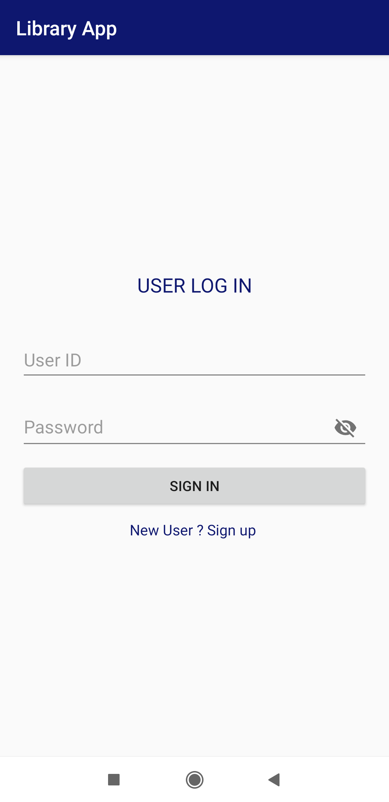|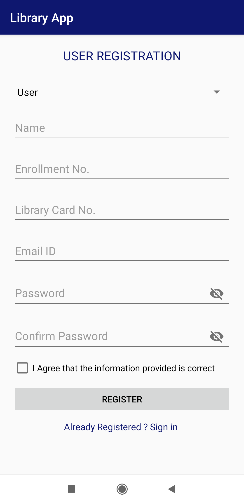|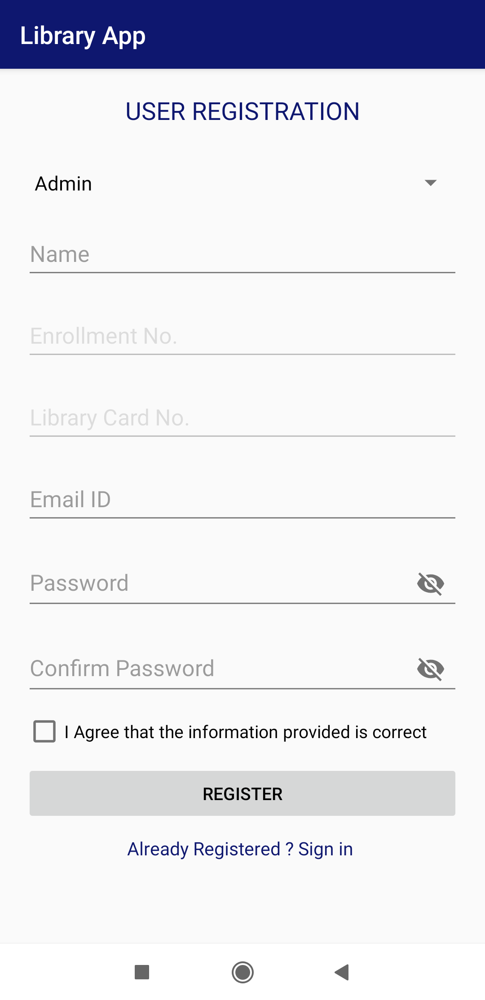|
|:---:|:---:|:---:|
|**Log In Page**|**User Registration Page**|**Admin Registration Page**|

|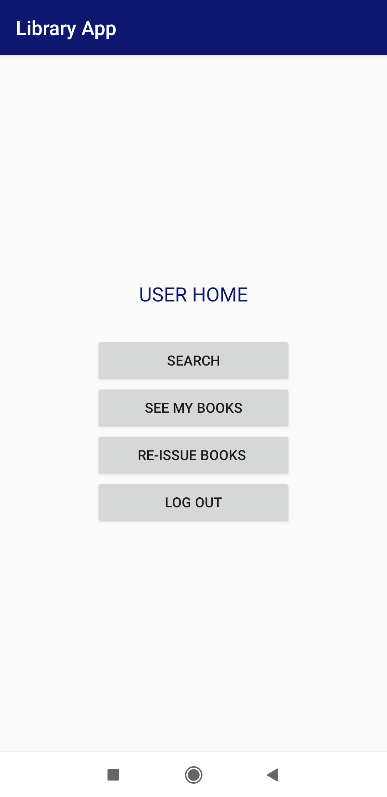|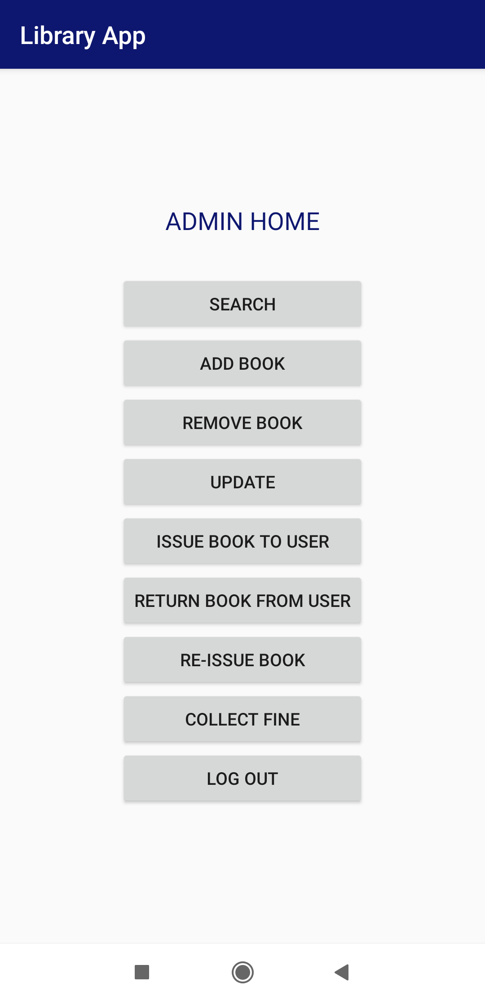|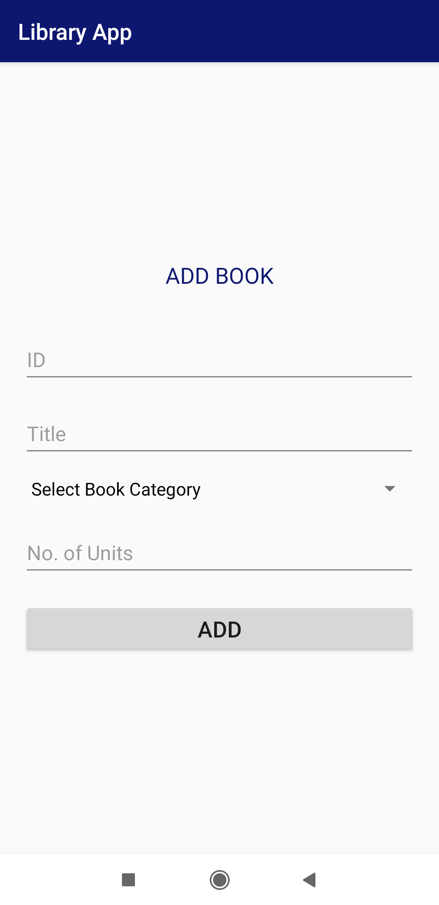|
|:---:|:---:|:---:|
|**User Home Page**|**Admin Home Page**|**Add Book Page**|

|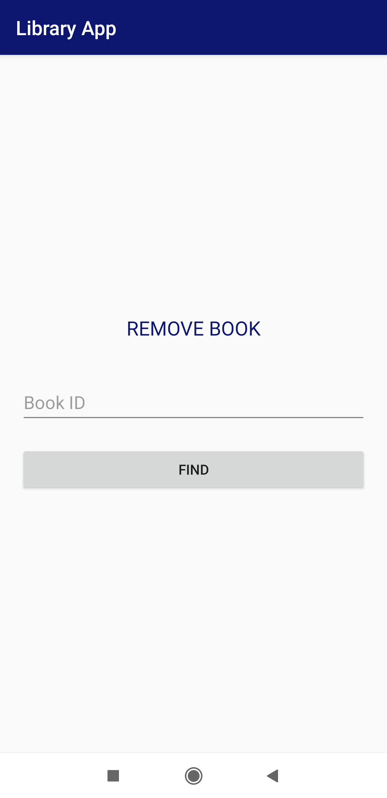|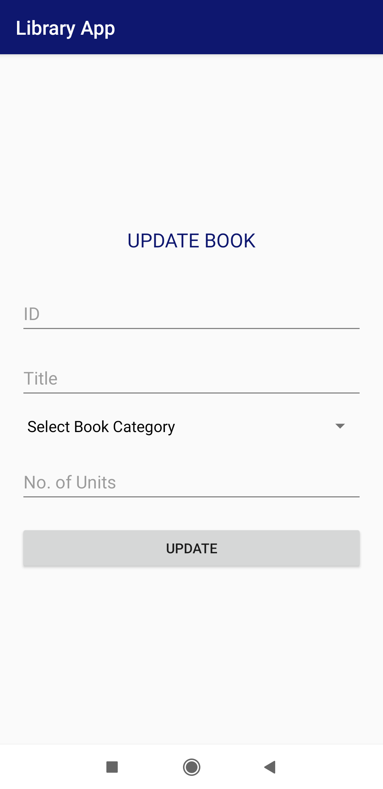||
|:---:|:---:|:---:|
|**Remove Book Page**|**Update Book Page**|**Issue Book Page**|

|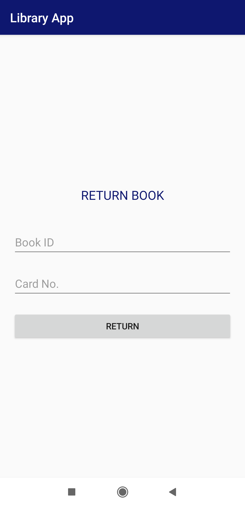|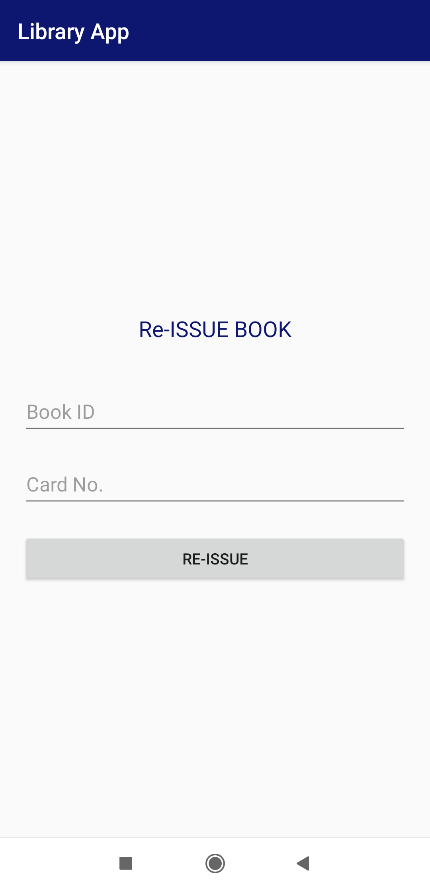|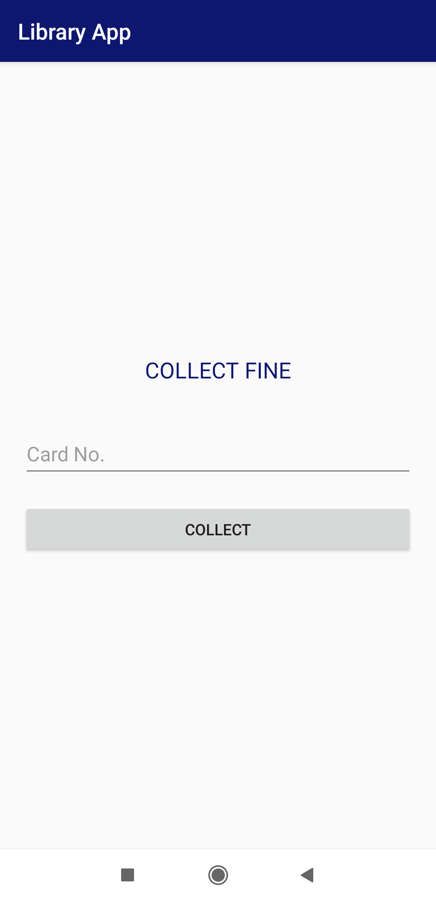|
|:---:|:---:|:---:|
|**Return Book Page**|**Reissue Book Page**|**Collect Fine Page**|

|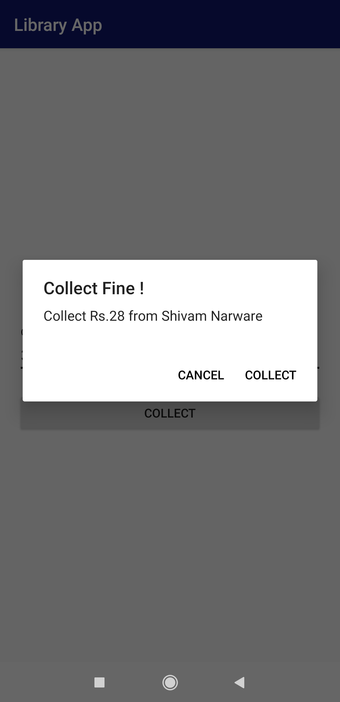|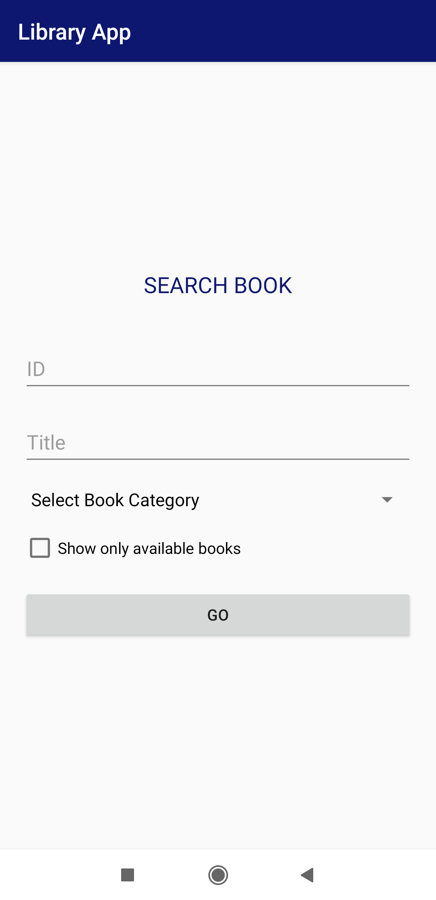|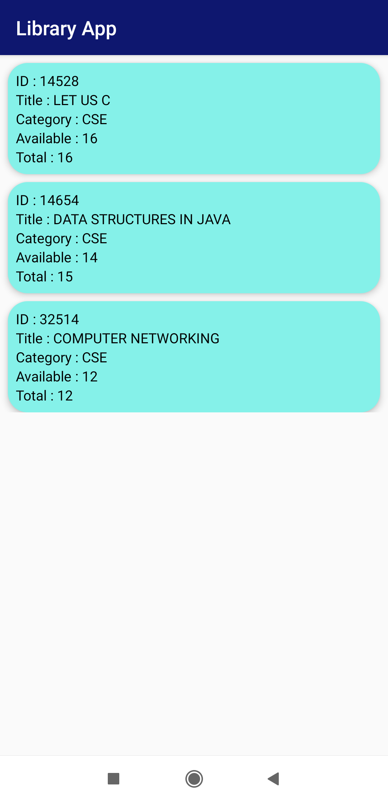|
|:---:|:---:|:---:|
|**Collect Fine Confirmation**|**Search Book Page**|**Search Book Results**|

|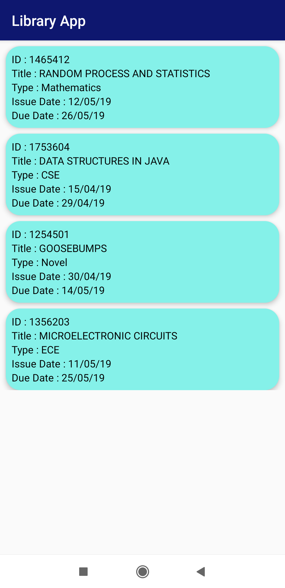|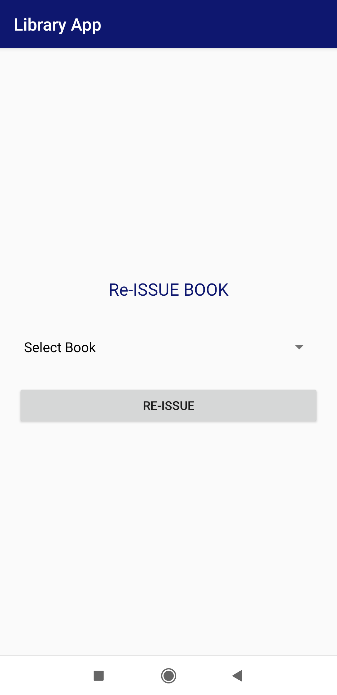|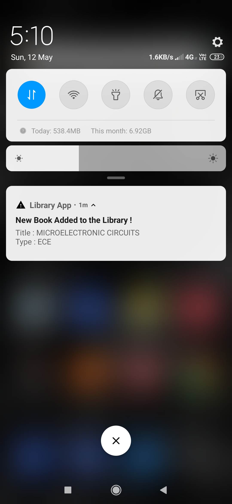|
|:---:|:---:|:---:|
|**See Issued Books Page**|**User Reissue Book Page**|**New Book Added Notification**|

|||
|:---:|:---:|
|**Deadline Approaching Notification**|**Fine Increased Notification**|

## Final Notes
**Thanks for going through this Repository! Have a nice day.** 
 **Got any Queries? Feel free to contact me.** 
 **Saini Rohan Rao**

